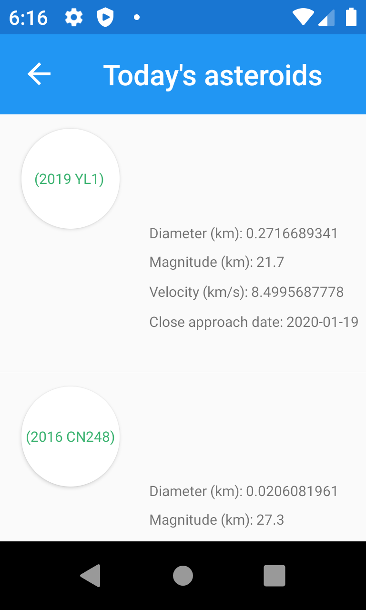
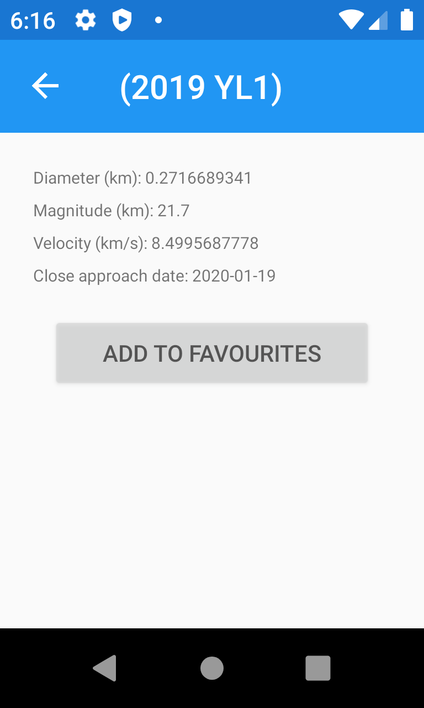

# OhMySky
Application has been created to track and display asteroids via API resource.
Application uses MVVM convention to keep proper structure for scaling ability.


Usage
--------------
<p align="center">
  
</p>

<b>Application has three main features:</b>

* It shows current date asteroids, that have been reported by NASA. Each of the asteroids is displayed with its diameter,
magnitude, relative velocity and close approach date. The circle label contains official name of the asteroid and is displayed in green,
when the asteroid is a non-hazardous one, and, respectively - in red if the asteroid is somehow hazardous.

<p align="center">
  
</p>

* It allows you to save asteroids, which seemed interesting to you. All you have to do is click on the particular asteroid, and then add it to your
favourites. There is no time limitation for storing the asteroids data. You can also remove the asteroid from your favourites.

<p align="center">
  
</p>

<p align="center">
  
</p>

* All your saved favourite asteroids can be found in the `FAVOURITE ASTEROIDS` view.

<p align="center">
  
</p>

* Each day NASA picks their favourite picture and call it a <b>picture of the day</b>. You can easily display it with its title in `NASA PIC OF THE DAY` view.

<p align="center">
  
</p>

Setup
--------------

Before you start developing application you need to change:
* ``` APIKey ``` variable in `Constants.cs` file. Api key can be generate via [https://api.nasa.gov](https://api.nasa.gov)

Supported Android versions:
--------------
* Minimum Android version - Android 5.0 (API level 21)
* Maximum Android version - Android 9.0 (API level 28)

External Services
--------------
- [https://api.nasa.gov](https://api.nasa.gov)

NuGet Packages
--------------
- Xamarin
- ReactiveUI
- Newtonsoft.Json - JSON framework
- SkiaSharp - 2D graphic framework
- sqlite-net-pcl - SQLite-net library
